# SOLID PRINCIPLES
## (S) -> Single Responsibility Principle
* A Class should have only one reason to change.
* Focused **single Responsibility** addresses a specific concern.
* If you can’t describe what a class does in one clear sentence without using "and", it’s probably doing too much.
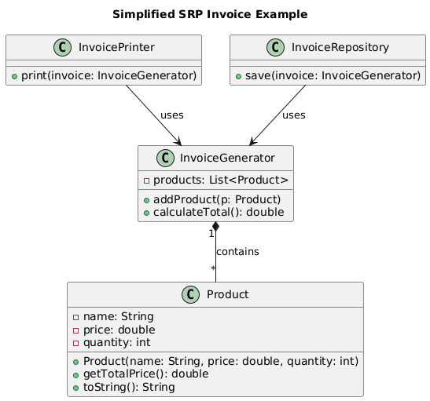

## (O) -> Open Closed Principle
* A class, module, or function should be open for extension but closed for modification.
* **Open** for extension → You should be able to add new functionality.
* Closed for modification → You should NOT change the existing code whenever a new requirement comes.
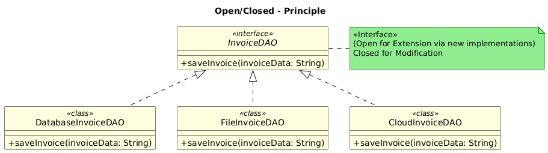

## (L) -> Liskov Substitution Principle
* Objects of a superclass should be replaceable with objects of its subclasses without breaking the application.
* Subclass should extend the capability of the parent class but not narrow it down.
* ✅ Example: Bird bird = new Sparrow(); → works fine, since Sparrow behaves like a Bird.
* ❌ Violation: Bird bird = new Penguin(); → breaks, since Penguin can’t fly but the parent expects fly().
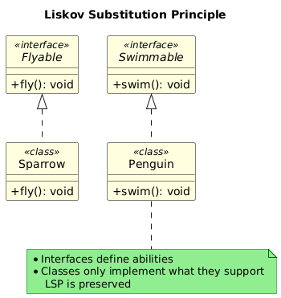

## (I) -> Interface Segregation Principle
* Interface should be such that the client should not implement unneccessary functions they do not need.
* Don’t force someone to depend on methods they don’t use.
* Keep interfaces small and focused, so classes only worry about what they actually do. 

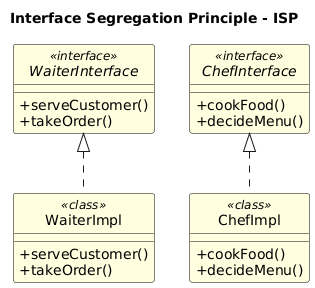

## (D) -> Dependency Inversion Principle
* High-level modules should not depend on low-level modules.
* Both should depend on abstractions.
* Abstractions should not depend on details.
* Details should depend on abstractions.

- In simple terms: 
If high-level logic directly depends on low-level implementations, changes in the low-level code can break the high-level logic.

- In more simple terms:
Class should depend on interface rather than concrete class.
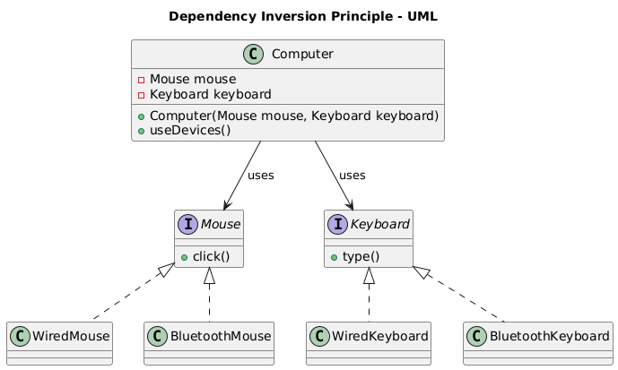

# Design-Patterns
## Creational Design Patterns
### 1. Factory Pattern
* Simple Factory : 
  A design pattern that delegates object creation to a single factory class, keeping your code clean and reducing coupling.
* Centralizes object creation
* Reduces repetitive new calls
* Keeps client code clean
* Perfect when you often switch between related object types

  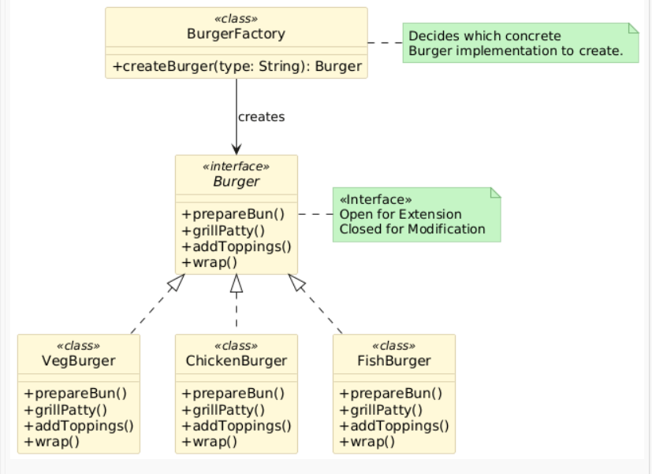

  ### 2. Factory Pattern
* Factory Method: 
  Defines an interface for creating an object.
* Lets subclasses decide which class to instantiate
* Decouples object creation from usage
* Keeps client code clean
* You order something, but you don’t know exactly which concrete object will be created.

  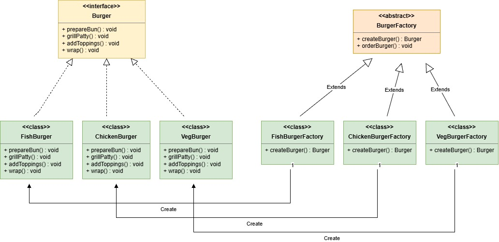

   ### 3. Factory Pattern
* Abstract Factory is a creational design pattern
* It provides an interface to create families of related objects
* The client does not know or care about concrete implementations
* Object creation logic is fully encapsulated

  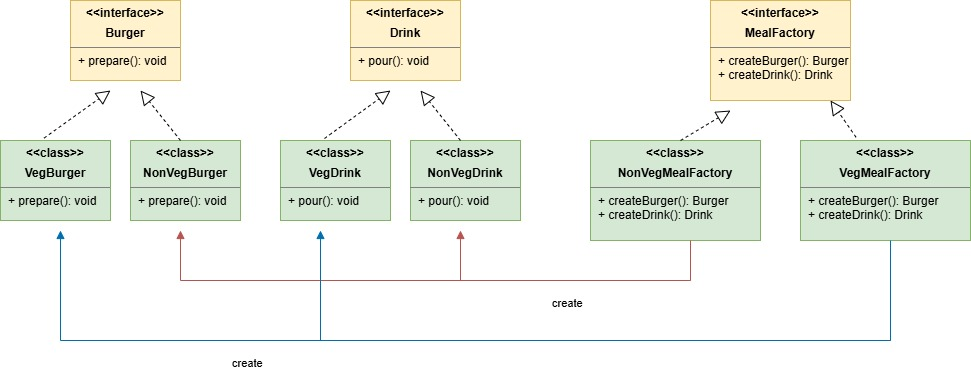

  ### 1. Builder Pattern
      * Standard Definiation:
        Separate the construction of a complex object from its representation, so that the same construction process can create different representations.
    #### Problem without Builder Pattern
    ##### 1. Constructor Explosion(telescoping constructors problem)
         * Every new optional param requires a new constructor overload.
         * Calls become uncreachable as you pass empty/dummy values for skipped field.
    ##### 2. Inconsistent Object states
         * partially build objects may be used before all required data is set.
    ##### 3. Mutable Objects
         * Exposing setters means client can change the object any time.
    ##### 4. Difficulties in validations
    ##### Why do we need the Builder Pattern?
         Problems it solves:
         ❌ Constructors with too many parameters
         ❌ Confusing parameter order
         ❌ Poor readability
         ❌ Hard to extend when new fields are added
         Benefits:
         ✅ Readable and fluent object creation
         ✅ Immutable objects
         ✅ Better control over object creation
         ✅ Same construction logic → different outputs
  ### 1️⃣ Simple Builder (Fluent Builder)
          A Simple Builder (also called Fluent Builder) is a creational pattern
          where a single builder class constructs an object step by step using method
          chaining, and the client directly calls build() to create the final object.
     #### Key Characteristics
          * Usually implemented as a static inner class
          * Uses fluent API (method chaining)
          * No Director class
          * All construction logic is inside the Builder
     #### When to Use
          * Object has many optional parameters
          * You want readable object creation
          * You want immutable objects
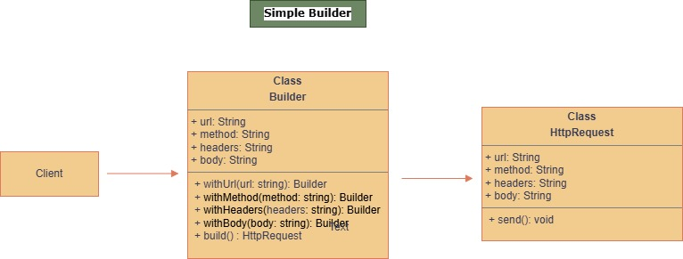

  ### 2️⃣ Director Builder (Classic GoF Builder)
          A Director Builder is the classic implementation described by the Gang of Four,
          where a separate Director class controls the construction process, and different 
          Concrete Builders create different representations of the product using the same building steps.
   #### Key Characteristics
        * Separate Builder interface
        * Multiple Concrete Builders
        * A Director orchestrates build steps
        * Same construction process → different outputs
   #### When to Use
        * Construction process must be reusable
        * Different representations of the same object are needed
        * Complex creation workflows
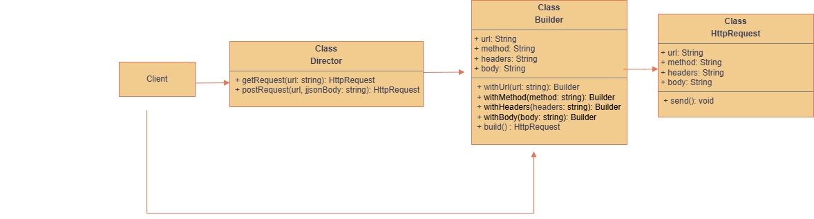

 ### 3️⃣ Step Builder
         A Step Builder is a variation of the Builder pattern that enforces the order of method calls at compile time using multiple interfaces, ensuring that              mandatory fields are set before the object can be built.
  #### Uses multiple step interfaces
       -> Enforces mandatory fields
       -> Provides compile-time safety
       -> Allows optional fields at the end
       -> Prevents incomplete object creation
  #### When to Use
       -> Strict creation workflow required
       -> Certain fields are mandatory
       -> You want compile-time safety
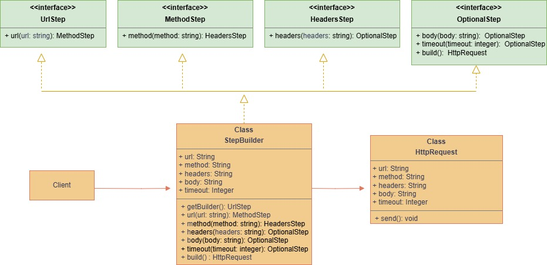

 ### 🔷 What is Prototype Design Pattern?
    The Prototype Pattern is a creational design pattern where new objects are created by copying (cloning) an existing object instead of creating from scratch using new.
  #### 🔷 Why Do We Need It?
       Use it when:
          * Object creation is expensive
          * Object has many configuration fields
          * You want to avoid complex constructor logic
          * You want to create objects at runtime dynamically

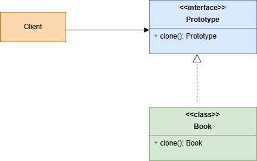

### 🔹 What is Singleton Design Pattern
        The Singleton Pattern ensures that a class has only one instance and provides a global access point to it.
#### Why is it important?

✅ Controls resource usage (e.g., DB connection, Logger, Config)
✅ Prevents unnecessary object creation
✅ Ensures consistency across the application

